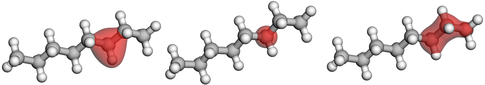

# OneQMC

This package provides an implementation of the Orbformer wave function foundation model.

We also provide the following:
- the [Neural Electron Real-space Density](https://arxiv.org/abs/2409.01306) model, which can be trained from Orbformer checkpoints
 - Light Atom Curriculum dataset, and other datasets referenced in the Orbformer paper
 - notebooks to reproduce figures from the paper

## Installation

You will need compute infrastructure in which it is possible to [install JAX](https://github.com/jax-ml/jax?tab=readme-ov-file#installation).
In our experiments, we used an Nvidia A100 GPU running on Linux with CUDA version 12. Some features of this repository require an Nvidia GPU that has compute
capability 8.0 or later.

1. Clone this repository
```bash
git clone https://github.com/microsoft/oneqmc.git
cd ./oneqmc
```

2. Install and activate the provided `conda` environment, which automatically installs JAX
```bash
conda env create -f environment-os.yaml -n oneqmc
conda activate oneqmc
```

3. Append the location of the `oneqmc` source files to your `PYTHONPATH`
```bash
export PYTHONPATH=$PYTHONPATH:$PWD/src
```

4. Test your set-up by running a simple single-point fine-tuning using the LAC checkpoint
```bash
python scripts/transferable.py -d CH4 -c checkpoints/lac/lac.chkpt --discard-sampler-state --max-eq-steps 100
```

## Running Orbformer

The main entrypoint for running wave function training and fine-tuning is `transferable.py`.

### Fine-tuning existing datasets

Many datasets that are mentioned in the paper are provided in the `data` directory.
The TinyMol dataset can be downloaded from the `deeperwin` repository and 
processed into our format by running
```bash
python scripts/download_tinymol_dataset.py
```

To fine-tune from the LAC checkpoint, use
```bash
python scripts/transferable.py -d <subdirectory of ./data> -c checkpoints/lac/lac.chkpt  --discard-sampler-state -n <number of training steps> -w <output directory>
```
and to train a model from scratch, use
```bash
python scripts/transferable.py -d <subdirectory of ./data> -n <number of training steps> -w <output directory>
```
We recommend using distinct output directories for every training run.
For other optional arguments, run `python transferable.py -h` for more information.

### Preparing new structure data for fine-tuning

To create a new dataset for fine-tuning, we recommend using [qcelemental](https://github.com/MolSSI/QCElemental) format.
Given a Python dictionary of the form
```python
structures: dict[str, qcel.model.Molecule] = {name: mol}
```
you can save this in a format that is readable by `oneqmc` via
```python
structures_flat = {k: v.dict(encoding="json") for k, v in structures.items()}
with open("./data/<dataset name>/structures.json", "w") as f_out:
  json.dump(structures_flat, f_out)
```
We also support nested directories as datasets, and dataset names containing `/`.

An alternative `.yaml` file format is also supported for datasets.

### Evaluation of the energy and accessing logged metrics

We recommend energy evaluation using a fresh evaluation run and by computing a robust mean on the evaluation energies.
A fresh evaluation run from a checkpoint can be launched using the `--test` argument, e.g.
```bash
python scripts/transferable.py -d <subdirectory of ./data> -n <number of test steps> -c <chkpt> --discard-sampler-state -w <different output directory> --test
```
This will run MCMC and energy evaluation without updating the model parameters.
We recommend using separate `-w` output directories for training and evaluation.

The saved energies from the evaluation can be accessed via the `h5` file
```python
from oneqmc.analysis import read_result
from oneqmc.analysis.energy import robust_mean

# If evaluating on a single GPU, this will have shape [num_mols, num_steps]
energy = read_result(
    test_output_directory,
    keys=["E_loc/mean_elec"],
    subdir="training",
)
# Robust mean of energies for structure 0
rmean_0 = robust_mean(energy[0, :]).squeeze()
```

Numerous other metrics are logged during training and evaluation, and be accessed in an analogous way.

A tensorboard log file is also generated automatically during training.

To store less output, you can pass the arguments `--metric-logger-period <int>` and `--metric-logger <subset of {h5, tb} possibly empty>`.

### Pausing and resuming training

Checkpoints are automatically generated during any training or fine-tuning run.
If you run the same training command with the same output directory passed to `-w`, the script will automatically resume from the last checkpoint. This behaviour can be switched off using `--no-autoresume`. To resume from some other checkpoint, pass the `-c` argument *without* using `--discard-sampler-state`, and this will restore the sampler and optimizer states as well as the model parameters.

To store fewer checkpoints, you can pass the arguments `--chkpts-fast-interval` and `--chkpts-slow-interval`.

### Limitations of the provided checkpoint

It is not possible to fine-tune from the LAC checkpoint on a molecule that contains a nucleus that
is heavier than Fluorine. For such molecule, we suggest training from scratch, or pretraining 
your own model.

### Pretraining your own model

For LAC pretraining Phase 2, we used the following settings, running on 16 GPUs
```bash
python scripts/transferable.py -d lightatomcurriculum/level2 --data-augmentation rotation fuzz --electron-batch-size 1024 --mol-batch-size 16 -n 1000000 --max-restarts 200 --multi-system-sampler double-langevin --repeated-sampling-len 40 --max-eq-steps 300 --metric-logger-period 25 -c <phase 1b checkpoint> --discard-sampler-state  -w <output directory>
```

Given an alternative pretraining dataset, you can launch a pretraining by adapting this command. Omit `-c <phase 1b checkpoint> --discard-sampler-state` to begin pretraining
from a randomly initialized network.

### Dealing with out-of-memory errors

There are several strategies that can employed for very large molecules that would naively cause OOM errors. 

1. Reduce `--electron-batch-size` and set `--mol-batch-size` equal to the number of GPUs.
1. Passing `--local-energy-chunk-size` will cause the local energy to be evaluated sequentially in blocks of the given size. For example, running with `--electron-batch-size 512 --local-energy-chunk-size 128` will compute local energies in 4 passes.
2. To fine-tune on a single, large molecule using multiple GPUs, use the flag `--repeat-single-mol` and pass a dataset of length 1.


## Plots and results from the Orbformer paper

The `notebooks/paper` directory contains notebooks that reproduce the plots shown in the paper.


## Training an electron density model
You can extract the electron density from an Orbformer checkpoint by fitting a new model
```bash
python scripts/density.py -d <dataset of size 1> -c <trained orbformer checkpoint> -w <output directory>
```
Note that density models are currently only supported for single molecules, so the dataset should be of size 1. You can filter out individual molecules from a larger dataset using `--data-file-whitelist` and `--data-json-whitelist`.
You can run `python scripts/density.py -h` for information on other arguments that are accepted by this script.

The training code will automatically evaluate the density on Lebedev-Laikov grids of various sizes during training.


## Citation 

If you use this repository, please cite our work.
The Orbformer model, checkpoints, training scheme:
```bibtex
@article{ main paper }
```
Electron density extraction:
```bibtex
@article{cheng2025highly,
  title={Highly accurate real-space electron densities with neural networks},
  author={Cheng, Lixue and Szab{\'o}, P Bern{\'a}t and Sch{\"a}tzle, Zeno and Kooi, Derk P and K{\"o}hler, Jonas and Giesbertz, Klaas JH and No{\'e}, Frank and Hermann, Jan and Gori-Giorgi, Paola and Foster, Adam},
  journal={The Journal of Chemical Physics},
  volume={162},
  number={3},
  year={2025},
  publisher={AIP Publishing}
}
```

## Contributing

This project welcomes contributions and suggestions.  Most contributions require you to agree to a
Contributor License Agreement (CLA) declaring that you have the right to, and actually do, grant us
the rights to use your contribution. For details, visit https://cla.opensource.microsoft.com.

When you submit a pull request, a CLA bot will automatically determine whether you need to provide
a CLA and decorate the PR appropriately (e.g., status check, comment). Simply follow the instructions
provided by the bot. You will only need to do this once across all repos using our CLA.

This project has adopted the [Microsoft Open Source Code of Conduct](https://opensource.microsoft.com/codeofconduct/).
For more information see the [Code of Conduct FAQ](https://opensource.microsoft.com/codeofconduct/faq/) or
contact [opencode@microsoft.com](mailto:opencode@microsoft.com) with any additional questions or comments.

## Trademarks

This project may contain trademarks or logos for projects, products, or services. Authorized use of Microsoft 
trademarks or logos is subject to and must follow 
[Microsoft's Trademark & Brand Guidelines](https://www.microsoft.com/en-us/legal/intellectualproperty/trademarks/usage/general).
Use of Microsoft trademarks or logos in modified versions of this project must not cause confusion or imply Microsoft sponsorship.
Any use of third-party trademarks or logos are subject to those third-party's policies.
